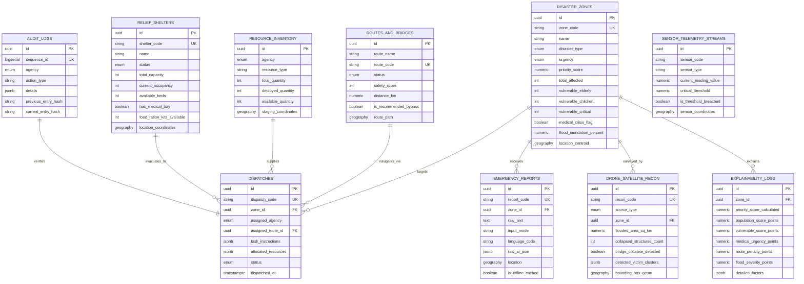

# 🗄️ RakshakAI — Supabase & PostGIS Database Schema Documentation

## 1. Overview

The RakshakAI Database is built on **PostgreSQL 15+** with **Supabase**, **PostGIS (Geographic Information System)**, and **pgcrypto**. It provides:
- **Sub-second Spatial Queries:** PostGIS indexing (`GIST`) for finding nearest ambulances, boat squads, and available relief shelters.
- **Supabase Realtime Subscriptions:** Live push updates for active disaster zones, IoT water sensor alerts, and field dispatches to the frontend Command Dashboard.
- **Multi-Agency Row Level Security (RLS):** Strict role-based isolation between Police, Medical, NDRF, and public users.
- **Cryptographic Audit Ledger:** SHA-256 chained hash logs ensuring post-disaster judicial and government inquiry compliance.

---

## 2. Entity-Relationship (ER) Diagram



---

## 3. Core Tables Specification

### 3.1. `disaster_zones`
Stores active disaster zones, real-time flood inundation crests, and computed triage scores.
| Column | Type | Constraints | Description |
| :--- | :--- | :--- | :--- |
| `id` | `UUID` | `PRIMARY KEY` | Unique Zone Identifier |
| `zone_code` | `VARCHAR(32)` | `UNIQUE, NOT NULL` | Human-readable code (e.g. `ZONE-DEL-A`) |
| `name` | `VARCHAR(255)` | `NOT NULL` | Zone Name & Location |
| `disaster_type` | `ENUM` | `NOT NULL` | `FLOOD`, `FIRE`, `LANDSLIDE`, etc. |
| `priority_score` | `NUMERIC(5,2)`| `CHECK (0..100)` | Computed 0–100 AI Triage Score |
| `location_centroid`| `GEOGRAPHY` | `Point, 4326` | PostGIS GPS Centroid |

### 3.2. `emergency_reports`
Ingests multilingual voice and text reports submitted by citizens and field operatives.
| Column | Type | Constraints | Description |
| :--- | :--- | :--- | :--- |
| `id` | `UUID` | `PRIMARY KEY` | Unique Report ID |
| `raw_text` | `TEXT` | `NOT NULL` | Raw Voice/Text transcript |
| `language_code`| `VARCHAR(10)`| `DEFAULT 'hi'` | Spoken language (`hi`, `en`, `bn`, etc.) |
| `raw_ai_json` | `JSONB` | `DEFAULT '{}'` | Structured entity extraction from AI |
| `is_offline_cached`| `BOOLEAN`| `DEFAULT FALSE` | Queued during cell outage |

### 3.3. `relief_shelters` (NEW)
Manages community evacuation centers, available beds, food rations, and medical capabilities.
| Column | Type | Constraints | Description |
| :--- | :--- | :--- | :--- |
| `id` | `UUID` | `PRIMARY KEY` | Unique Shelter ID |
| `shelter_code` | `VARCHAR(32)` | `UNIQUE, NOT NULL` | Code (e.g. `SHELTER-NORTH-01`) |
| `total_capacity`| `INTEGER` | `> 0` | Total bed capacity |
| `available_beds`| `INTEGER` | `GENERATED ALWAYS` | `total_capacity - current_occupancy` |
| `has_medical_bay`| `BOOLEAN`| `DEFAULT TRUE` | Emergency trauma/medical triage capability |
| `location_coordinates`| `GEOGRAPHY`| `Point, 4326` | PostGIS GPS Location |

### 3.4. `drone_satellite_recon` (NEW)
Telemetry from ISRO/Sentinel satellites and UAV quadcopters for automated flood extent & bridge damage detection.
| Column | Type | Constraints | Description |
| :--- | :--- | :--- | :--- |
| `id` | `UUID` | `PRIMARY KEY` | Unique Recon Pass ID |
| `flooded_area_sq_km`| `NUMERIC` | `NOT NULL` | Total inundated surface area |
| `bridge_collapse_detected`| `BOOLEAN`| `NOT NULL` | True if computer vision confirms structural failure |
| `detected_victim_clusters`| `JSONB`| `DEFAULT '[]'` | GPS points of trapped rooftop victims |

### 3.5. `routes_and_bridges`
Live road network graph for dynamic rerouting and safe bypass selection.
| Column | Type | Constraints | Description |
| :--- | :--- | :--- | :--- |
| `route_name` | `VARCHAR(128)`| `NOT NULL` | Route Name (e.g. `Route B Highland Bypass`) |
| `status` | `ENUM` | `NOT NULL` | `CLEAR`, `BLOCKED`, `HAZARD_WARNING` |
| `safety_score` | `INTEGER` | `CHECK (0..100)` | Safety index (Route B = 96, Route A = 12) |
| `is_recommended_bypass`| `BOOLEAN`| `NOT NULL` | True if AI pathfinding selects this route |

---

## 4. PostGIS Geospatial Queries

### 4.1. Finding Nearest Available Resources
```sql
SELECT * FROM public.find_nearest_resources(
    p_lat := 28.6139,
    p_lng := 77.2090,
    p_radius_km := 10.0,
    p_agency := 'NDRF'
);
```

### 4.2. Finding Nearest Open Shelter with Capacity
```sql
SELECT * FROM public.find_nearest_open_shelter(
    p_lat := 28.6139,
    p_lng := 77.2090,
    p_required_beds := 25
);
```

---

## 5. Supabase Realtime & Python Integration

```python
import os
from supabase import create_client, Client

SUPABASE_URL = os.environ.get("SUPABASE_URL", "https://your-project.supabase.co")
SUPABASE_KEY = os.environ.get("SUPABASE_ANON_KEY", "your-anon-key")

supabase: Client = create_client(SUPABASE_URL, SUPABASE_KEY)

# Fetch active critical zones
response = supabase.table("disaster_zones") \
    .select("*") \
    .eq("urgency", "CRITICAL") \
    .order("priority_score", desc=True) \
    .execute()

print(response.data)
```
