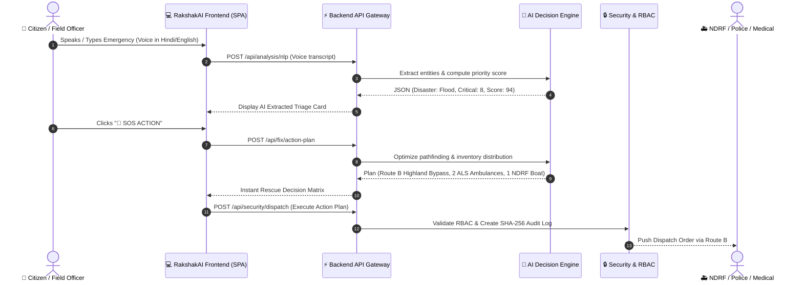

# 🔄 RakshakAI — Operational Workflow & Demo Guide

This document details the end-to-end operational lifecycle of emergency events in RakshakAI and provides the step-by-step 2-Minute Judge Demo Workflow.

---

## 1. End-to-End Emergency Lifecycle



---

## 2. The 2-Minute Judge Demo Mode (8-Step Walkthrough)

Clicking **`🎤 JUDGE DEMO MODE`** in the top navigation bar triggers an automated walkthrough designed for hackathon evaluation:

1. **Stage 1: System Baseline**
   - Initializes baseline disaster telemetry for Delhi NCR (Yamuna Basin).
2. **Stage 2: Multilingual Emergency Voice Ingestion**
   - Transcribes a regional Hindi emergency report (*"Yamuna bank ke paas paani badh gaya hai..."*), extracts 30 trapped residents, and flags medical needs.
3. **Stage 3: AI Rescue Priority Calculation**
   - Evaluates Area A as **Score 94/100 (CRITICAL)** over Area B (Score 72) and Area C (Score 38).
4. **Stage 4: Explainability Decision Math**
   - Opens the `"Why Area A?"` modal displaying exact point breakdowns (Population, Vulnerable, Route Penalty, Inundation).
5. **Stage 5: Dynamic Safe Route Reroute**
   - Detects that Highway Bridge 4 is submerged (Route A closed); auto-calculates Route B (Highland Bypass).
6. **Stage 6: Satellite Computer Vision Analysis**
   - Runs simulated drone/satellite flood detection (98.4% inundated zone, collapsed bridge identified).
7. **Stage 7: Digital Twin Stress Test**
   - Slides flood crest to 85%, triggering automated ambulance bottleneck warnings.
8. **Stage 8: Multi-Agency Dispatch & Offline Sync**
   - Issues verified task orders to NDRF and logs cryptographically hashed tamper-proof audit trails.

---

## 3. Core API Endpoint Reference

### 3.1. Calculate Priority Score
- **Endpoint:** `POST /api/analysis/priority`
- **Request Payload:**
```json
{
  "affected": 850,
  "vulnerable": { "elderly": 42, "children": 17, "critical": 8, "disabled": 12 },
  "medical_crisis": true,
  "route_status": "BLOCKED",
  "flood_level": 65
}
```
- **Response:**
```json
{
  "success": true,
  "data": {
    "score": 94,
    "urgency_level": "CRITICAL",
    "breakdown": [
      { "factor": "Affected Population Size", "points": 25 },
      { "factor": "Critical & Vulnerable Groups", "points": 24 },
      { "factor": "Medical Emergency Need", "points": 15 },
      { "factor": "Route Accessibility & Penalty", "points": 16 },
      { "factor": "Flood Severity Impact", "points": 14 }
    ]
  }
}
```

### 3.2. Generate SOS Action Plan
- **Endpoint:** `POST /api/fix/action-plan`
- **Request Payload:**
```json
{
  "area_name": "Area A — Yamuna Sector 9"
}
```
- **Response:**
```json
{
  "success": true,
  "data": {
    "target_zone": "Area A — Yamuna Sector 9",
    "priority_score": 96,
    "urgency": "CRITICAL",
    "recommended_route": "Route B (Highland Bypass)",
    "required_resources": {
      "ambulances": 2,
      "ndrf_teams": 1,
      "water_liters": 500,
      "med_kits": 1
    },
    "tactical_steps": [
      "Dispatch 2 Ambulances from Command Base via Route B immediately.",
      "Alert NDRF Team 3 for rubber boat deployment across flooded riverbank.",
      "Air-drop 500L Water & Medical Kits to Sector 9 Community Center roof.",
      "Redirect incoming traffic away from Highway Bridge 4."
    ]
  }
}
```
